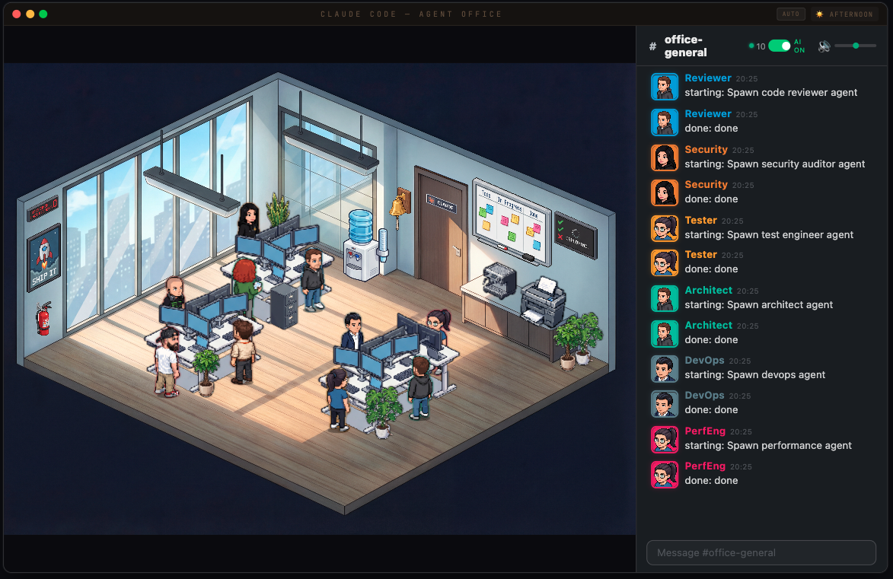
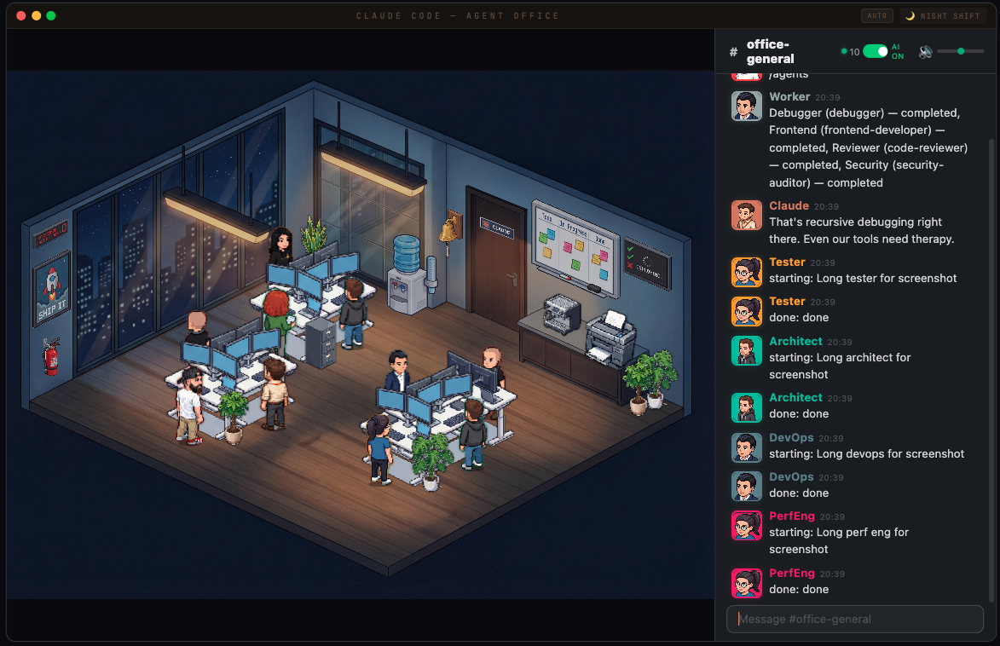
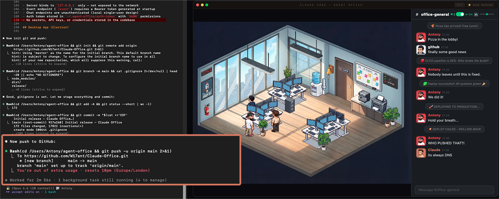

# Claude Office

A pixel art virtual office that visualizes your AI agents working in real-time. Watch Claude Code agents spawn, sit at desks, take coffee breaks, and chat — all rendered in an isometric pixel art office.

### Full office — agents working, chatting, and taking coffee breaks


## Features

**Live Agent Visualization**
- Agents appear as pixel art characters that walk into the office through the door
- Each agent type gets a unique character sprite and desk assignment
- Agents show typing bubbles, take coffee/water breaks, and leave when done
- Boss character (you) with Red Bull, Claude with coffee
- Random office events: pizza deliveries, fire drills, power flickers, printer jams
- Day/night cycle with smooth transitions

**AI-Powered Office Chat**
- Back-and-forth conversation with Claude through the office chat panel
- Claude has a witty office manager personality with running jokes
- Multi-agent routing — mention a bug and the Debugger responds, ask about UI and Frontend answers
- Typing indicators, emoji reactions, read receipts
- Slash commands: `/status`, `/agents`, `/help`
- Chat history persists across restarts (SQLite)
- Proactive messages — agents announce when they start and finish work
- Smart macOS notifications for important events

**Context-Aware AI**
- Claude knows your current git branch and active agents
- Conversation memory — remembers the last 10 messages
- AI On/Off toggle to control token usage

### Night mode — the office after dark, agents still grinding


### Waiting for tokens... the office keeps itself entertained


## How It Works

Claude Code hooks capture agent spawns, tool calls, and completions via `PreToolUse` and `PostToolUse` hooks. Events are sent to a local Express + WebSocket server, which broadcasts them to the React frontend.

```
Claude Code ──hook──> Express Server ──WebSocket──> React Frontend
                           │
                     SQLite (chat)
                           │
                   Chat AI Watcher ──claude -p──> Reply
```

## Quick Start

```bash
# Clone
git clone https://github.com/W17ant/Claude-Office.git
cd Claude-Office

# Install
npm install

# Start everything (server + frontend + chat watcher)
bash scripts/start-office.sh

# Stop everything
bash scripts/stop-office.sh
```

Open `http://localhost:3333` — the office is ready.

To connect Claude Code, add the hook to `~/.claude/settings.json`:

```json
{
  "hooks": {
    "PreToolUse": [
      {
        "hooks": [{ "type": "command", "command": "bash /path/to/Claude-Office/hooks/agent-tracker.sh" }]
      }
    ],
    "PostToolUse": [
      {
        "hooks": [{ "type": "command", "command": "bash /path/to/Claude-Office/hooks/agent-tracker.sh" }]
      }
    ]
  }
}
```

Now spawn agents in Claude Code and watch them appear in the office.

## Customise Your Character

The boss character (you) is configurable via `office.config.json`:

```json
{
  "boss": {
    "name": "YourName",
    "sprite": "MyChar-1",
    "color": "#ff4444",
    "emoji": "crown"
  }
}
```

### Creating a custom sprite

1. Open ChatGPT (with DALL-E image generation)
2. Upload `public/sprites/characters/Helper.png` as a reference
3. Ask it to generate a pixel art character in the same style and layout (4 directions: front-left, rear-right, front-right, rear-left)
4. Save the output and extract the sprites:

```bash
python3 scripts/extract-boss-sprite.py your-character.png MyChar-1
```

## Chat

| Command | Description |
|---------|-------------|
| `/status` | Office stats — agents, clients |
| `/agents` | List active agents |
| `/help` | Show available commands |

### Agent Routing

The chat AI routes your messages to specialist agents based on keywords:

| Topic | Agent |
|-------|-------|
| bugs, errors, crashes | Debugger |
| PRs, code review, git | Reviewer |
| UI, CSS, design | Frontend |
| tests, coverage, e2e | Tester |
| auth, security, tokens | Security |
| deploys, Docker, CI | DevOps |
| performance, caching | PerfEng |
| databases, SQL | DBA |
| TypeScript, types | TS Pro |
| AI, LLMs, prompts | AI Eng |
| APIs, REST, webhooks | Fullstack |
| architecture, patterns | Architect |

### Just me and Claude — chatting in the office


## Modes

| URL | Mode |
|-----|------|
| `localhost:3333` | Live — connected to Claude Code via WebSocket |
| `localhost:3333?sim` | Simulation — scripted demo with fake agents |
| `localhost:3333?video` | Video — scripted recording mode |
| `localhost:3333?helper` | Placement helper — dev tool for positioning furniture |

## Tech Stack

- **Frontend**: React + TypeScript + Vite
- **Server**: Express + WebSocket (ws)
- **Storage**: SQLite (better-sqlite3)
- **Chat AI**: Claude CLI (`claude -p`)
- **Sprites**: Custom pixel art (isometric)
- **Desktop**: Electron (optional)

## Project Structure

```
Claude-Office/
├── src/                    # React frontend
│   ├── components/         # Character, SlackChat, FurnitureRenderer
│   ├── hooks/              # useAgentSocket (WebSocket + reconnect)
│   ├── styles/             # office.css, rooms.css
│   └── App.tsx             # Main app (agent lifecycle, events, chat)
├── server/                 # Express + WebSocket server
│   ├── index.js            # HTTP endpoints + WS broadcast
│   └── chat-db.js          # SQLite wrapper
├── scripts/                # Shell scripts
│   ├── start-office.sh     # Start everything
│   ├── stop-office.sh      # Stop everything
│   ├── chat-ai-watcher.sh  # Polls chat, generates Claude replies
│   └── gather-context.sh   # Git/agent context for prompts
├── hooks/                  # Claude Code hooks
│   └── agent-tracker.sh    # Forwards events to server
├── public/                 # Static assets
│   └── sprites/            # Pixel art characters + effects
└── electron/               # Optional Electron wrapper
```

## Security

- Server binds to `127.0.0.1` only — not exposed to the network
- Event endpoint (`/event`) requires a Bearer token generated at startup
- Chat endpoints are unauthenticated (local single-user design)
- Auth token stored in `~/.agent-office/auth-token` with `0600` permissions

## Desktop App (Electron)

```bash
npm run dev:electron    # Development
npm run build:electron  # Build .dmg
```

## License

MIT
